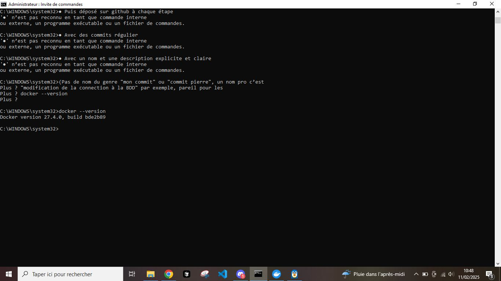
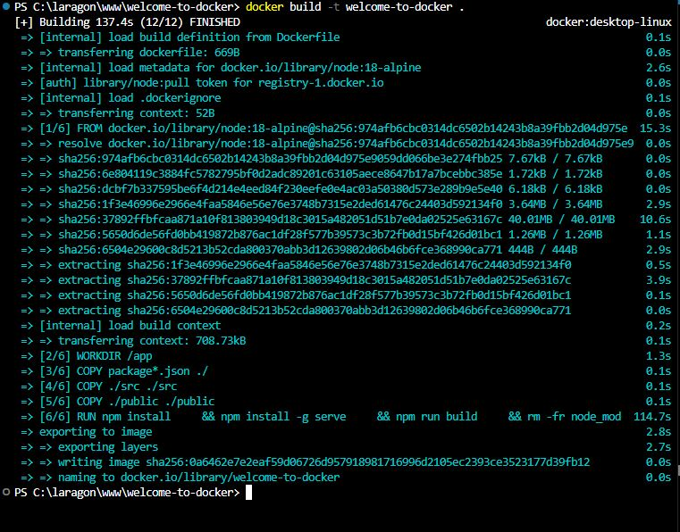
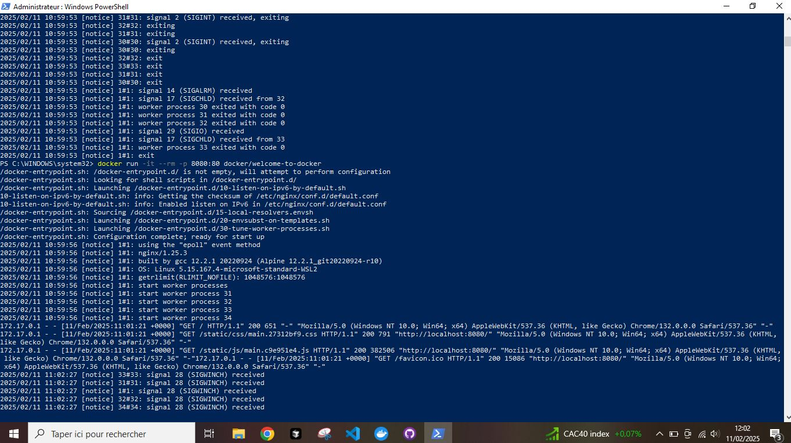
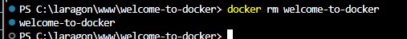
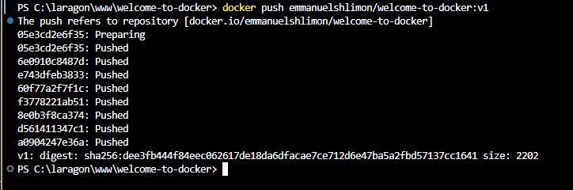

# Docker Training

## Job 01 - Welcome to Docker (Part 1)

### 1. Installation et Configuration
- Installation de Docker
- Création du compte Docker
- Connexion au compte Docker

### 2. Commandes de base
```bash
docker --version
```


### 3. Construction et utilisation du conteneur
```bash
# Pull de l'image
docker pull docker/welcome-to-docker

# Construction du conteneur
docker build -t welcome-to-docker .
```


```bash
# Lancement du conteneur
docker run -d -p 8088:80 welcome-to-docker
```


### 4. Suppression
```bash
# Suppression du conteneur
docker rm welcome-to-docker
```


## Job 02 - Welcome to Docker (Part 2)

### 1. Configuration du projet
```bash
# Vérification de la position dans le projet
pwd
```


### 2. Analyse des fichiers
J'ai analysé le Dockerfile du projet qui contient les instructions suivantes :

```dockerfile
# Start your image with a node base image
FROM node:18-alpine

# The /app directory should act as the main application directory
WORKDIR /app

# Copy the app package and package-lock.json file
COPY package*.json ./

# Copy local directories to the current local directory of our docker image (/app)
COPY ./src ./src
COPY ./public ./public

# Install node packages, install serve, build the app, and remove dependencies at the end
RUN npm install \
    && npm install -g serve \
    && npm run build \
    && rm -fr node_modules

EXPOSE 3000

# Start the app using serve command
CMD [ "serve", "-s", "build" ]
```

### 3. Construction et lancement du conteneur
```bash
# Construction de l'image
docker build -t welcome-to-docker-v2 .

# Lancement du conteneur avec un nom spécifique
docker run -d -p 8088:3000 --name welcome-to-docker-v2 welcome-to-docker-v2
```


### 4. Vérification du conteneur
```bash
# Vérification des conteneurs en cours d'exécution
docker ps

# Vérification des logs
docker logs welcome-to-docker-v2
```


### 5. Accès au conteneur
```bash
docker exec -it welcome-to-docker-v2 sh
```


### 6. Modification du code
J'ai modifié le fichier `src/App.js` pour personnaliser l'application :
```javascript
// Modification du message d'accueil
const shareMessage = "I just modified my first Docker container!";

// Modification du texte affiché
<h1 style={{ marginBottom: "0px" }}>Bravo Emmanuel!!!</h1>
<p style={{ marginTop: "10px", marginBottom: "50px" }}>
  Vous avez modifié votre premier conteneur Docker avec succès.
</p>
```

### 7. Reconstruction et test des modifications
```bash
# Arrêt et suppression des anciens conteneurs
docker stop welcome-to-docker-v2 welcome-to-docker-v2-modified
docker rm welcome-to-docker-v2 welcome-to-docker-v2-modified

# Reconstruction de l'image avec les modifications
docker build -t welcome-to-docker-v2:modified .

# Lancement du nouveau conteneur
docker run -d -p 8088:3000 --name welcome-to-docker-v2 welcome-to-docker-v2:modified
```


### 8. Publication de l'image sur Docker Hub
```bash
# Connexion à Docker Hub
docker login

# Tagger l'image pour Docker Hub
docker tag welcome-to-docker-v2:modified emmanuelshlimon/welcome-to-docker:v1

# Publier l'image
docker push emmanuelshlimon/welcome-to-docker:v1
```


### 9. Test de l'image d'un collègue
```bash
# Pull de l'image du collègue
docker pull kilam13/welcome-to-docker:latest

# Lancement de son image
docker run -d -p 8090:3000 --name welcome-to-docker-collegue kilam13/welcome-to-docker:latest
```

> Image originale créée par Malik ([kilam13])

### 10. Modification de l'image d'un collègue
> Image originale créée par Malik ([kilam13])

```bash
# Reconstruction avec nos modifications
docker build -t emmanuelshlimon/welcome-to-docker:v2-from-kilam13 .

# Lancement de notre version modifiée
docker run -d -p 8091:3000 --name welcome-to-docker-from-kilam13 emmanuelshlimon/welcome-to-docker:v2-from-kilam13

# Publication sur Docker Hub
docker push emmanuelshlimon/welcome-to-docker:v2-from-kilam13
```


## Job 03 - Super Mario Docker

### 1. Recherche et découverte de l'image
#### Méthode 1 : Via le terminal Docker
```bash
# Recherche de l'image dans Docker Hub
docker search pengbai/docker-supermario
```


### 2. Récupération de l'image
#### Méthode 1 : Via le terminal
```bash
# Pull de l'image via le terminal
docker pull pengbai/docker-supermario
```


### 3. Lancement du conteneur
#### Méthode 1 : Via le terminal
```bash
# Lancement avec le port 8600
docker run -d -p 8600:8080 --name supermario pengbai/docker-supermario
```


#### Méthode 2 : Via Docker Desktop
[Capture d'écran montrant les étapes dans Docker Desktop]


### 4. Test du jeu
[Captures d'écran du jeu en cours]


### 5. Arrêt du conteneur
#### Méthode 1 : Via l'ID du conteneur
```bash
# Trouver l'ID du conteneur
docker ps

# Arrêter le conteneur avec l'ID
docker stop 10f8754a8e1a
```


#### Méthode 2 : Via le nom du conteneur
```bash
# Arrêter le conteneur avec le nom
docker stop supermario-hd
```


### 6. Suppression du conteneur
#### Méthode 1 : Via le terminal (méthode utilisée)
```bash
# Supprimer le conteneur avec l'ID ou le nom
docker rm supermario-hd
```


#### Méthode 2 : Via Docker Desktop
> Note : Cette méthode est également possible en utilisant l'interface graphique de Docker Desktop, en allant dans l'onglet "Containers" et en cliquant sur l'icône poubelle.

### 7. Suppression de l'image
#### Méthode 1 : Via le terminal (méthode utilisée)
```bash
# Supprimer l'image
docker rmi pengbai/docker-supermario
```


#### Méthode 2 : Via Docker Desktop
> Note : Cette méthode est également possible en utilisant l'interface graphique de Docker Desktop, en allant dans l'onglet "Images" et en cliquant sur l'icône poubelle.

## Job 04 - Docker Apache PHP

### 1. Création des fichiers
#### index.php
```php
<?php phpinfo(); ?>
```

#### Dockerfile
```dockerfile
FROM php:8.2-apache
COPY index.php /var/www/html/
EXPOSE 80
```

### 2. Construction de l'image
```bash
# Se positionner dans le dossier
cd docker/Jour02/job04

# Construire l'image
docker build -t apache-php-info .
```


### 3. Lancement du conteneur
```bash
# Lancer le conteneur
docker run -d -p 8080:80 --name apache-php apache-php-info
```


### 4. Test de l'application
Accès à l'application via http://localhost:8080 pour voir les informations PHP


### 5. Arrêt du conteneur
```bash
# Arrêter le conteneur
docker stop apache-php
```


## Job 05 - Tic Tac Toe avec Docker Volumes

### 1. Configuration du projet
- Création des fichiers nécessaires :
  - index.html (interface du jeu)
  - save.php (sauvegarde des résultats)
  - results.json (stockage des résultats)
  - Dockerfile (configuration du conteneur)

### 2. Création du Dockerfile
```dockerfile
FROM nginx:alpine
COPY index.html /usr/share/nginx/html/
COPY save.php /usr/share/nginx/html/
COPY results.json /usr/share/nginx/html/
EXPOSE 80
```

### 3. Création du volume et construction de l'image
```bash
# Création du volume nommé
docker volume create game-results

# Construction de l'image
docker build -t tic-tac-toe .
```


### 4. Lancement du conteneur avec le volume
```bash
docker run -d --name tictactoe-game -v game-results:/app/results tic-tac-toe
```


### 5. Vérification du volume et des données

#### Via le terminal
```bash
# Vérification des volumes
docker volume ls

# Inspection du volume
docker volume inspect game-results

# Affichage du contenu du conteneur
docker exec -it tictactoe-game ls /usr/share/nginx/html

# Affichage du contenu du fichier results.json
docker exec -it tictactoe-game cat /usr/share/nginx/html/results.json
```


#### Via Docker Desktop


### 6. Résultats des parties
Contenu du fichier results.json après plusieurs parties :


### 7. Arrêt du conteneur
```bash
docker stop tictactoe-game
```


